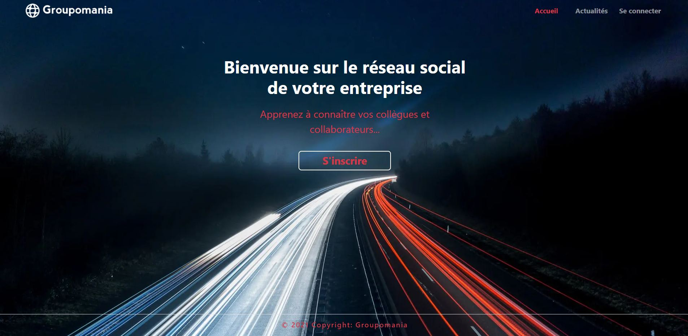

# Groupomania

# Projet 7 de la formation Openclassrooms - Développeur Web

Objectif: Réalisé un mvp de réseau social d'entreprise. L'utilsation doit-être simple, l'inscription, la connexion, la déconnexion et la suppression de compte doit-être possible.
La lecture des articles et l'ajout n'est possible qu'après connexion. Les articles peuvent-être modérés.

Contraintes techniques: base de donnée sql, utiliser un framework front.

Charte graphique: Seul les logos sont définis.

J'ai choisi Nodejs pour le backend avec Sequelize pour la base de donnée, des requêtes brutes auraient été suffisantes mais je souhaitais découvrir Sequelize.
Pour le front, j'ai choisi de faire l'intégration avec bootstrap 5 pour plusieurs raisons: le temps, la cohérence graphique et surtout parce que sa maitrise est très demandée. Concernant le framework, j'ai choisi VueJs car je l'avais déjà utilisé et j'apprècie beaucoup son fonctionnement et sa facilité de prise en main.

# Démarrage du backend

A l'intérieur du dossier backend:
Duppliquer le fichier .env.example à la racine et le renommer en .env
Dans le fichier .env, remplir les variables d'environnement qui permmettra la connexion à la bdd.
Modifier la chaine secrète du token si besoin.

Ouvrir le terminal et installer npm avec la commande suivante: npm -install
puis: npm run start - le server démarre et affiche "connexion à MongoDB  réussie !"

# Démarrage du frontend 

A l'intérieur du dossier frontend:
Duppliquer le fichier .env.example à la racine et le renommer en .env

Ouvrir le terminal et installer npm avec la commande suivante: npm -install
puis: npm run serve - le live server démarre et vous invite à cliquer sur un lien: -local: http://localhost:8080/
